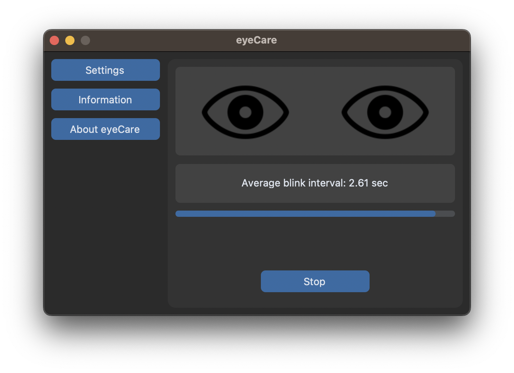
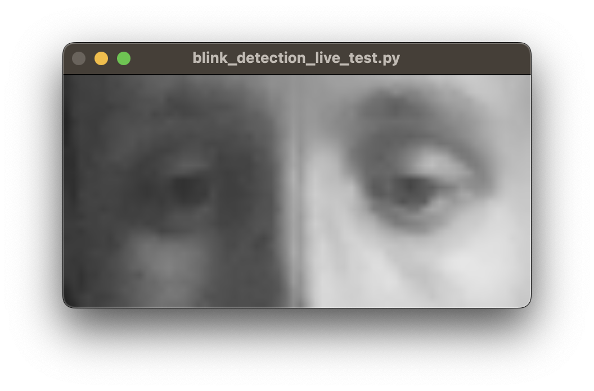

# eyeCare



## Installation and usage

Create virtual environment and install libraries:
```
python -m venv .
source bin/activate
python -m pip install -r requirements.txt
```
Run app:
```
cd app
python app.py
```

## Dataset

Download mrlEyes_2018_01 and create mrlEyes_open_closed dataset with images separated into train, vlaid and test folders with open and closed folders each:
```
wget http://mrl.cs.vsb.cz/data/eyedataset/mrlEyes_2018_01.zip
unzip mrlEyes_2018_01.zip
cd model_training
python create_dataset.py
```
(Can take a few minutes)

## Model training

```
       OPERATION           DATA DIMENSIONS   WEIGHTS(N)   WEIGHTS(%)

           Input   #####     32   32    1
          Conv2D    \|/  -------------------      1664     0.2%
        softplus   #####     28   28   64
    MaxPooling2D   Y max -------------------         0     0.0%
                   #####     14   14   64
          Conv2D    \|/  -------------------    131200    16.5%
        softplus   #####     11   11  128
    MaxPooling2D   Y max -------------------         0     0.0%
                   #####      5    5  128
          Conv2D    \|/  -------------------    131328    16.6%
        softplus   #####      4    4  256
         Flatten   ||||| -------------------         0     0.0%
                   #####        4096
           Dense   XXXXX -------------------    524416    66.1%
        softplus   #####         128
         Dropout    | || -------------------         0     0.0%
                   #####         128
           Dense   XXXXX -------------------      4128     0.5%
        softplus   #####          32
         Dropout    | || -------------------         0     0.0%
                   #####          32
           Dense   XXXXX -------------------        33     0.0%
         sigmoid   #####           1
```
Train CNN classifier model and copy best model to model_training/trained_models and app/ml_models/tensorflow:
```
python training.py
cd checkpoints
cp best_model.hdf5 ../trained_models
cp best_model.hdf5 ../../app/assets/trained_models
```
(Training takes approximately 15 minutes for 50 epochs on Nvidia RTX3070)

Evaluation on test dataset not used in training process:
```
python evaluation.py
```

## Live evaluation of model:

A trained model can be live-tested with sound feedback:
```
cd model_training/live_test
python blink_detection_live_test.py
```




```
cd model_training/live_test
python dlib_face_landmark_live_test.py
```


