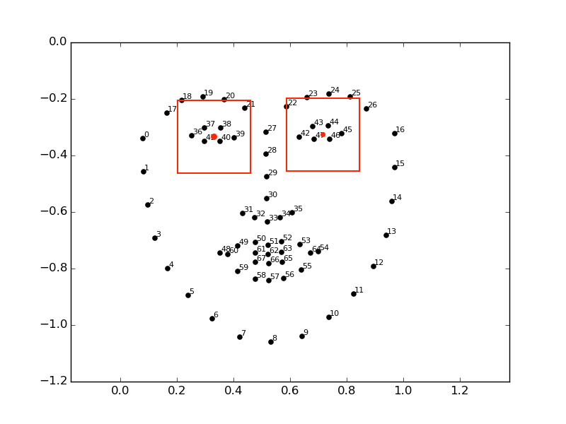

Best open/closed eye-detection: eye_blink_3_32x.h5
 - IMAGE_SIZE is 32 by 32
 - trained on half the mrlEyes_2018_01 dataset (about 40.000 images)
 - took about 2 hours on cpu with 15 epochs
 - real accuracy test on unseen mrlEyes images: 95%

Eye detection worked best with dlib-shape_predictor_68_face_landmarks.dat.
OpenCV Haarcascade has very high false-positive eye detection rate, and
was not usefull in this case.

Run real_testing/dlib_eye_detection.py for demonstration.

### Dlib_Face_Landmarks:
